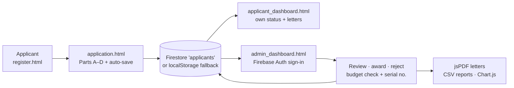

<p align="center">
  <a href="https://jmsmuigai.github.io/Bursary/"></a>
  
  
  
  <a href="https://www.tovutech.com/projects/bursary/"></a>
  <a href="https://jmsmuigai.github.io/Bursary/"></a>
</p>

## What it is

The **Garissa County Modern Bursary Management System (MBMS)** moves the county's paper bursary form online. Students (or their parents) register, fill in the four-part application from the official Garissa bursary form, and track their status; the Fund Administrator reviews applications, awards or rejects them against a budget, and produces letters and reports.

It is a static web app (HTML, CSS, JavaScript) hosted on GitHub Pages, using Firebase Authentication and Cloud Firestore when configured and browser `localStorage` as a fallback / demo mode.

## Highlights

**For applicants**
- 📝 Instructions page, then account registration with duplicate email / ID detection.
- 🧾 Multi-step application (Parts A–D) with a progress indicator, auto-save every 2 seconds, manual save and drafts.
- 📊 Personal dashboard showing only the applicant's own application, awarded amount and serial number.
- 📄 Award letter preview, print and PDF download (works on phones and laptops).

**For the Fund Administrator**
- 🔐 Single admin account signing in through Firebase Authentication (no password in the code).
- 💰 Budget tracking against a KSh 50,000,000 baseline: deduction on award, utilisation %, warnings at 80% and when exhausted, and blocking awards that exceed the balance.
- 🔎 Filters by sub-county (all Garissa sub-counties + "Other"), ward (populated from the sub-county) and status.
- ✅ Award with amount and justification or reject with a reason; automatic serial numbers (`GRS/Bursary/001`, `002`, …).
- 🖨️ Client-side PDFs with jsPDF: award, rejection and status letters and application summaries, with the county logo, signature and stamp images.
- 📈 Summary report and charts (Chart.js): allocations by sub-county, gender distribution, average awards; CSV exports (beneficiary list, financial allocation, demographics, budget utilisation).
- ✉️ Email drafts to the fund office via `mailto:` links (no server-side email yet).

## How it works



Firestore rules (`firestore.rules`) let anyone create an application, but only the authenticated fund administrator can read or update applications; deletions are blocked.

## Tech stack

| Layer | Tools |
|---|---|
| Frontend | HTML5, CSS3, Bootstrap 5.3, vanilla JavaScript |
| Auth & data | Firebase Authentication, Cloud Firestore (compat SDK 9.23), `localStorage` fallback |
| Documents & charts | jsPDF 2.5, Chart.js 4 |
| Hosting | GitHub Pages via GitHub Actions (`.github/workflows/pages.yml`), `.nojekyll`, `404.html` |

## Getting started

**Use the live demo:** https://jmsmuigai.github.io/Bursary/

**Run locally:**

```bash
git clone https://github.com/jmsmuigai/Bursary.git
cd Bursary
python3 -m http.server 8080     # open http://localhost:8080
```

Without Firebase the app runs in demo mode on `localStorage` (data stays in that browser).

**Connect your own Firebase project:**

1. Create a project at https://console.firebase.google.com/ and enable **Email/Password** authentication and **Cloud Firestore**.
2. Put your project's web config in `firebase_config.js`, and restrict the web API key to your domain in Google Cloud.
3. Create the fund-administrator user in Firebase Authentication (set the password there, never in code).
4. Deploy the rules in `firestore.rules` (replace `ADMIN_USER_ID_HERE` with the admin UID).

### For applicants

1. Open the site → **Read Instructions First** → **Register** (email, ID / birth-certificate number).
2. Complete all four parts of the form (auto-saves; you can continue later).
3. Submit, then follow your status on the dashboard and download your letter when awarded.

### For administrators

1. Sign in with the fund-administrator account.
2. Filter and open applications → **View**.
3. Award (amount + justification) or reject (reason); letters are generated as PDFs.
4. Use **Reports** for the summary and CSV downloads.

### Project structure

```
Bursary/
├── index.html, instructions.html, register.html, application.html
├── applicant_dashboard.html, admin_dashboard.html, help.html
├── styles.css, firebase_config.js, firestore.rules, firebase.json
├── js/          auth, application, admin, budget, pdf-generator, data (sub-counties/wards), Firebase DB, utilities and test helpers
├── assets/      signature, stamp and banner images
└── .github/workflows/pages.yml
```

### Application form sections

- **Part A – Student details:** names, gender, phone numbers (student and parent/guardian), institution, registration number, year/form, course and duration.
- **Part B – Family information:** parent status, disability, parents'/guardian's names and occupations, siblings, previous bursaries.
- **Part C – College/University:** principal/head details and comments, discipline rating, outstanding fees.
- **Part D – Financial information:** monthly income, annual fees, fee balance, amount requested, justification.

### Garissa sub-counties and wards included

- **Garissa Township:** Waberi, Galbet, Township, Iftin
- **Lagdera:** Modogashe, Benane, Goreale, Maalimin, Sabena, Baraki
- **Dadaab:** Dertu, Dadaab, Labasigale, Damajale, Liboi, Abakaile
- **Fafi:** Bura, Dekaharia, Jarajila, Fafi, Nanighi
- **Balambala:** Balambala, Danyere, Jarajara, Saka, Sankuri
- **Ijara:** Hulugho, Sangailu, Ijara, Masalani

Applicants can choose "Other (Specify)" if their location is not listed.

## Data & privacy

- Applications contain **personal data** of students and families (names, ID numbers, phone numbers, family and financial details). With Firebase they are stored in the county's Firestore project; in demo mode they stay in the user's browser.
- Applicant passwords for local accounts are stored as salted SHA-256 hashes, not plain text.
- **No real applicant data is committed to this repository.** Built-in demo/test records are fictitious.
- Applicants can see only their own application in the app.

## Status & roadmap

**Status:** working web app published on GitHub Pages and ready for a supervised pilot. It is client-side only, so security depends on correct Firebase Auth and Firestore rules configuration.

Next steps:
- [ ] Move applicant accounts fully to Firebase Authentication.
- [ ] Server-side email/SMS notifications (currently `mailto:` drafts).
- [ ] QR-code verification on letters.
- [ ] Document uploads (fee structures, ID copies) with Firebase Storage.
- [ ] Consolidate the many fix/test helper scripts in `js/`.

## Security

Please report vulnerabilities privately — see [SECURITY.md](SECURITY.md).

## Contact

- Fund office: `fundadmin@garissa.go.ke`
- Technical: intelligence@tovutech.com

---

<p align="center">
  <b>Built by James M. Mburu · TovuTech Limited</b><br>
  <a href="https://www.tovutech.com">https://www.tovutech.com</a> · <a href="mailto:intelligence@tovutech.com">intelligence@tovutech.com</a><br>
  📖 Case study: <a href="https://www.tovutech.com/projects/bursary/">tovutech.com/projects/bursary</a>
</p>
